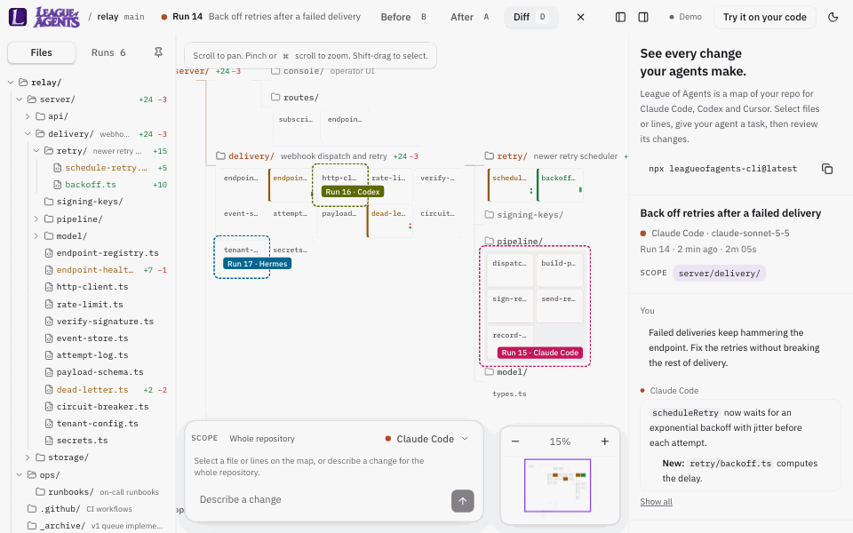

<p align="center"></p>

[English](README.md) · [简体中文](README.zh-CN.md) · [Français](README.fr.md) · [Português (Brasil)](README.pt-BR.md) · [Español](README.es.md)

> Tradução beta, ainda não revisada por um falante nativo. O [README.md](README.md) em inglês é a referência.

## O que é o League of Agents?

**See every change your agents make.**<br>
Veja cada mudança que seus agentes fazem.

League of Agents é um mapa do seu código onde você dirige agentes de código e revisa o trabalho deles.

Agentes de código mudam mais código do que qualquer pessoa consegue revisar linha por linha. League of Agents mostra seu projeto como um mapa, e cada mudança que um agente faz aparece nele. Você vê o que mudou, onde, e se ainda funciona, e então mantém ou desfaz.

Ele roda no seu computador, funciona com os agentes que você já usa e é open source.



## O que você pode fazer

- **Veja seu projeto de uma vez.** As pastas e os arquivos de código dele em um só mapa. Afaste o zoom para ver a forma, aproxime para ler o código.
- **Aponte um agente para linhas exatas.** Selecione um arquivo, uma pasta ou algumas linhas e descreva a mudança. Com os hooks ativados, o Claude Code é impedido de editar fora da sua seleção com suas ferramentas de edição. Os hooks ficam desativados até você dizer sim: o primeiro `npx leagueofagents-cli@latest` em um terminal pergunta uma vez e lembra, e sem um terminal eles ficam desativados a menos que você passe `--hooks`. Para conferir, procure `"hooks": true` em `.loa/bridge.json`. Edições do Codex e do Cursor fora da sua seleção são sinalizadas depois da execução, e as do Claude Code também, quando os hooks estão desativados ou quando ele usa um comando de shell.
- **Edite arquivos você mesmo.** Dê um clique duplo no código de um arquivo para abri-lo no editor. As edições salvas são registradas e podem ser desfeitas como qualquer execução de agente.
- **Atualize o que depende de uma mudança.** Renomeie uma função e peça ao agente para atualizar cada arquivo que a usa. O diff da sua mudança vai para o prompt do agente. O mapa mostra cada arquivo que ele tocou.
- **Revise antes de manter.** Alterne entre Antes, Depois e Diff, percorra os arquivos mudados e então mantenha a execução ou desfaça com um clique.
- **Rode suas verificações automaticamente.** Testes e checagens de tipos rodam depois de cada execução que muda arquivos, para você saber se ainda funciona.

## Início rápido

Abra um terminal em qualquer pasta de projeto que seja um repositório git e escolha uma opção:

**Deixe seu agente configurar.** Cole isto no Claude Code, no Codex ou no Cursor:

```text
Read leagueofagents.dev/setup.md and set up League of Agents in this repo.
```

**Ou rode você mesmo:**

```bash
npx leagueofagents-cli@latest
```

O que acontece em seguida:

1. League of Agents inicia em segundo plano e abre seu repositório como um mapa no navegador.
2. No Chrome, Edge, Brave e Arc, ele abre em leagueofagents.dev. O navegador pede uma vez para deixar o site alcançar seu computador: escolha Permitir. No Safari e no Firefox, ele abre o app local, que não precisa de permissão.
3. Selecione um arquivo, descreva uma mudança e pressione Enter.

### Requisitos

- macOS. O Linux passa em toda a suíte de testes, mas ainda não foi experimentado com um agente de verdade. O Windows ainda não é suportado.
- git. No Mac, ele vem com as ferramentas de linha de comando para desenvolvedores da Apple: `xcode-select --install`. No Linux, pelo seu gerenciador de pacotes.
- Node 20 ou mais recente
- Um repositório git
- Claude Code instalado e com login feito, para rodar agentes a partir do mapa. Sem ele, mudanças de qualquer editor continuam aparecendo.

## Funciona com

Claude Code, a partir do mapa ou do seu terminal. Hermes Agent e DeepSeek Harness, a partir do mapa, pelo Agent Client Protocol (o Hermes precisa do extra `acp`). Codex e Cursor estão em beta. Mudanças de qualquer outro editor ou agente aparecem pelo modo de observação. Cada execução mostra o modelo que o agente informou.

Qualquer outro harness que fale o Agent Client Protocol pode ser adicionado nas suas próprias configurações, nunca nas de um repositório:

```json
[{ "id": "goose", "name": "Goose", "command": ["goose", "acp"] }]
```

Salve como `~/.config/league-of-agents/agents.json` e reinicie o League of Agents. Chaves, provedores e modelos ficam nas configurações de cada harness. O Hermes pergunta antes de editar, e o DeepSeek Harness roda no modo somente leitura, então também pergunta: uma edição fora da sua seleção é recusada. Um harness adicionado que não pergunta tem essas edições sinalizadas depois da execução.

<sub>Construído e testado com Claude Code, Hermes Agent e DeepSeek Harness. O suporte a Codex e Cursor segue os formatos publicados por eles e passa em testes contra esses formatos, mas ainda não foi totalmente verificado com execuções reais.</sub>

## Como usar

**A partir do mapa.** Selecione arquivos, pastas ou linhas, escolha um agente, descreva a mudança e pressione Enter. Quando a execução terminar, revise e mantenha ou desfaça. Com uma execução concluída selecionada, seu próximo prompt continua a mesma sessão. Remova o chip "Continuação" para começar do zero.

As linhas selecionadas são identificadas pelo texto delas e pelas linhas ao redor, não pelos números. Se edições, uma troca de branch ou um rebase moverem o código, a seleção acompanha. Se o código mudou, foi removido ou não pode ser distinguido de uma cópia idêntica, a seleção avisa e nada roda até você selecionar de novo. Quando um agente edita dentro da sua seleção, a seleção passa a ser as novas linhas.

Edições feitas durante a execução de um agente contam nessa execução, inclusive as suas. Só uma execução acontece por vez.

**A partir do seu terminal.** Use o Claude Code, o Codex ou o Cursor como de costume. Com os hooks ativados, cada prompt que você envia vira uma execução no mapa, com o prompt como título.

**A partir de qualquer editor.** É só trabalhar. Quando os arquivos que você mudou ficam parados por alguns segundos, o League of Agents os registra como uma execução, como "main.py editado". Arquivos que o git ignora e arquivos novos que costumam guardar segredos ([listados abaixo](#privacidade-e-segurança)) nunca são registrados, e trocas de branch e pulls nunca geram uma execução.

Um arquivo renomeado mantém seu lugar no mapa e aparece como renomeado, com o que mudou nele. Uma pasta renomeada por inteiro também mantém seu lugar.

### Verificações

Se o seu repositório não tem nenhuma configurada, o League of Agents procura scripts de teste e de typecheck e o pytest, e oferece ativá-los. Elas ficam guardadas na sua pasta pessoal, fora do seu repositório, a menos que você escolha compartilhá-las com sua equipe em `loa.config.json`. Verificações que um repositório inclui no commit do seu `loa.config.json` são oferecidas com os comandos delas, e só rodam depois que você as ativa na sua cópia; se a lista mudar, elas esperam por você de novo. Uma verificação que não consegue rodar na sua máquina, porque algo de que ela precisa não está instalado, aparece como "Não deu para rodar" em vez de falhar, e pode ser desativada com um clique. Veja [`loa.config.example.json`](loa.config.example.json) para escrever as suas.

### O que ele grava na sua máquina

No seu repositório:

- `.loa/`: registros de execuções, a porta e o token da ponte, um índice privado de snapshots, uma cópia da ponte que os hooks rodam, o layout do mapa e um log. Ela fica fora do git por meio de `.git/info/exclude`, e a ponte não inicia em um repositório que faz commit dela.
- Snapshots: commits git sob refs privadas `refs/loa/`, guardados em `.git/objects`. Eles nunca tocam seu branch nem a área de staging.
- `loa.config.json`, só se você escolher compartilhar suas verificações com sua equipe.

Na sua pasta pessoal:

- `~/.config/league-of-agents/repos/`: um arquivo por repositório com as verificações que você ativou ou aprovou nele. Fica fora do repositório, então nada que um repositório contenha pode autorizar os próprios comandos.

Nas configurações dos agentes, só depois que você disser sim aos hooks:

- Claude Code: `.claude/settings.local.json` no repositório, mantido fora do git.
- Codex: `.codex/hooks.json` no repositório, mantido fora do git se o League of Agents o criou.

Um arquivo de hooks que está no git nunca é editado: os hooks guardam caminhos deste computador. O League of Agents avisa isso ao iniciar, e as sessões de terminal desse agente não são registradas.
- Cursor: `~/.cursor/hooks.json` na sua pasta pessoal. O Cursor lê hooks de projeto só da pasta que ele abriu, que muitas vezes fica acima do repositório.

Seus próprios hooks nesses arquivos nunca são alterados. Seu navegador também guarda a porta e o token da ponte, e suas escolhas de painéis, tema e idioma, no próprio armazenamento dele.

Para removê-lo:

| O quê | Como |
|---|---|
| Hooks, nos três arquivos | `npx leagueofagents-cli@latest hooks remove`. Um arquivo que o League of Agents criou é apagado; um arquivo que você já tinha volta a ser como era. |
| Tudo no repositório: hooks, `refs/loa/`, `.loa/` e as linhas dela em `.git/info/exclude`, e as verificações que você permitiu para ele | `npx leagueofagents-cli@latest uninstall` |
| Objetos de snapshot em `.git/objects` | Sem referências depois do `uninstall`. O git os remove sozinho depois de duas semanas, ou na hora com `git gc --prune=now`. |
| `loa.config.json` | Apague, se foi você que o criou. |
| O que seu navegador guarda | Clique em Desconectar, ou limpe os dados do site leagueofagents.dev. |

## O que ele envia

League of Agents never uploads your code anywhere. Your code goes only to the agent you authorized.
League of Agents nunca envia seu código para lugar nenhum. Seu código vai só para o agente que você autorizou.

- **A ponte** conversa só com 127.0.0.1: o app no seu navegador e os hooks dos seus agentes. Ela não faz nenhuma outra requisição de rede. Ela roda o git localmente e nunca faz fetch nem push. Ao iniciar, ela abre seu navegador em leagueofagents.dev ou no app local, e roda `claude auth status` para ver se o Claude Code está com login feito.
- **leagueofagents.dev** serve arquivos estáticos: a página, seus scripts, fontes e imagens. Ele conversa com a ponte direto do seu navegador, então seu código, seus prompts e suas execuções trafegam só entre o seu navegador e o seu computador. Ele conta visualizações de página com o Vercel Web Analytics: o caminho da página, sem nada depois de `?` ou `#`; o site que levou até ela; país, região e cidade, deduzidos da requisição; e o sistema operacional, o navegador e o tipo de dispositivo. Sem cookies. O app que a ponte serve no seu computador não conta nada. Os detalhes estão na [página de privacidade](https://leagueofagents.dev/privacy).
- **A instalação** baixa o pacote do registro do npm.
- **Seu agente** recebe seu prompt e uma lista dos arquivos ou linhas selecionados, como caminhos e números de linha. "Atualizar o que depende disto" também coloca o diff da sua mudança no prompt. O agente envia o que lê e o que recebe ao seu próprio provedor, sob os termos desse provedor.
- **Suas verificações** rodam os comandos que você ativou. O que elas fazem depende delas.

## Como ele inicia seu agente

Quando você roda um agente a partir do mapa, a ponte o inicia no seu repositório com estes comandos. `<prompt>` é o seu prompt com o escopo escrito acima dele.

| Agente | Comando |
|---|---|
| Claude Code | `claude -p <prompt> --output-format stream-json --verbose --permission-mode acceptEdits` |
| Cursor | `cursor-agent -p --force --output-format stream-json <prompt>` |
| Codex | `codex exec --json --sandbox workspace-write <prompt>` |

Uma continuação adiciona `--resume <session>` para o Claude Code e o Cursor, e `resume <session>` para o Codex. O que cada flag de permissão permite:

- **Claude Code, `--permission-mode acceptEdits`:** ele cria e edita arquivos no repositório sem perguntar, e **roda `mkdir`, `touch`, `rm`, `rmdir`, `mv`, `cp` e `sed` lá sem perguntar.** Outros comandos de shell e requisições de rede precisam de uma regra que você define no Claude Code; com `-p` não há ninguém para quem perguntar, então eles são negados. ([modos de permissão](https://code.claude.com/docs/en/permission-modes#auto-approve-file-edits-with-acceptedits-mode), [execuções não interativas](https://code.claude.com/docs/en/headless#auto-approve-tools)) A trava de escopo é um dos hooks, então só funciona quando você disse sim aos hooks. Ela verifica só as ferramentas de edição do Claude Code. Uma mudança feita com um desses comandos de shell não é bloqueada; ela é sinalizada depois da execução se estiver fora da sua seleção.
- **Cursor, `-p --force`:** **ele roda comandos de shell sem perguntar.** `-p` dá a ele todas as ferramentas, incluindo escrita e shell, e `--force` permite comandos a menos que você os tenha negado explicitamente. ([parâmetros da CLI](https://cursor.com/docs/cli/reference/parameters))
- **Codex, `exec --sandbox workspace-write`:** **ele roda comandos no repositório sem perguntar.** Ele lê e edita arquivos e roda comandos dentro do repositório. O acesso à rede fica desligado, e ele não pode ir além do repositório. ([modo não interativo](https://learn.chatgpt.com/docs/non-interactive-mode), [aprovações e segurança](https://learn.chatgpt.com/docs/agent-approvals-security))

## Privacidade e segurança

League of Agents never uploads your code anywhere. Your code goes only to the agent you authorized.
League of Agents nunca envia seu código para lugar nenhum. Seu código vai só para o agente que você autorizou. O que ele envia, e para onde, está [acima](#o-que-ele-envia). Quem pode alcançar o League of Agents no seu computador, e como ele é protegido, está em [docs/THREAT-MODEL.md](docs/THREAT-MODEL.md). Relate problemas de segurança de forma privada, como explica o [SECURITY.md](SECURITY.md).

Os snapshots deixam de fora arquivos que o git ignora, e qualquer arquivo ainda sem commit com um destes nomes, em qualquer pasta: `.env`, `.env.*`, `*.pem`, `*.key`, `*.p12`, `*.pfx`, `*.jks`, `*.keystore`, `*.kdbx`, `id_rsa`, `id_dsa`, `id_ecdsa`, `id_ed25519`, `.npmrc`, `.pypirc`, `.netrc`, `.git-credentials`, `.htpasswd`, `credentials.json`, `secrets.json`, `secrets.yaml`, `secrets.yml`, `service-account*.json`, `*.tfvars`. Esta lista não é completa: um segredo com qualquer outro nome entra no snapshot como qualquer arquivo, então guarde segredos em arquivos que o git ignora. Um arquivo que já está em um commit faz parte do histórico do seu repositório, e os snapshots o incluem.

Os snapshots ficam no seu computador a menos que você os envie: `git push`, `git push --all` e `git push --tags` nunca incluem `refs/loa/`, mas `git push --mirror` envia todas as refs, incluindo `refs/loa/`, e copiar a pasta `.git` também. Rode `uninstall` antes se você espelhar um repositório.

## Limites

- macOS. O Linux passa em toda a suíte de testes na CI, mas ainda não foi experimentado com um agente de verdade; nele, o app local é aberto. O Windows ainda não é suportado.
- Máquinas remotas, SSH e dev containers não são suportados. O League of Agents precisa rodar no mesmo computador que o seu navegador.
- O mapa mostra até 1.500 arquivos de código, e as primeiras 400 linhas de cada um. Arquivos com mais de 400 KB não aparecem no mapa. Os diffs guardam as primeiras 4.000 linhas de um arquivo.
- Arquivos que não são de código, como imagens, entram nos snapshots e no desfazer, mas não aparecem no mapa.
- Arquivos que o git ignora e arquivos novos que costumam guardar segredos nunca são registrados.
- Uma execução por vez em um repositório.
- Comandos de shell. O Hermes os roda sem perguntar, exceto os que considera perigosos, que o League of Agents recusa. O DeepSeek Harness os roda em modo somente leitura, então um comando que grava é recusado. Tudo o que um comando muda no repositório faz parte da execução: é sinalizado se estiver fora da sua seleção, e desfeito ao reverter a execução.
- Ele guarda as 500 execuções mais recentes, e todas as execuções dos últimos 30 dias. Execuções mais antigas são apagadas, junto com seus snapshots.
- O site precisa do Chrome, Edge, Brave ou Arc. O Safari e o Firefox usam o app local.

## Comandos e opções

| Comando | O que faz |
|---|---|
| `npx leagueofagents-cli@latest` | Inicia o League of Agents em segundo plano e abre seu navegador |
| `... status` | Mostra se ele está rodando, e o link dele |
| `... stop` | Para o League of Agents |
| `... uninstall` | Remove tudo o que ele adicionou ao repositório |
| `... hooks remove` | Remove só os hooks dele |

| Opção | Padrão | O que faz |
|---|---|---|
| `--port`, `LOA_PORT` | Primeira porta livre a partir de 43210 | Porta em que o League of Agents escuta |
| `--web`, `LOA_WEB_URL` | `https://leagueofagents.dev` | Site a abrir em navegadores da família Chrome |
| `--local` | Desligado | Usa só o app local, em todos os navegadores: o site nunca é aberto e não consegue se conectar |
| `--hooks`, `--no-hooks` | Pergunta uma vez | Adiciona ou pula os hooks dos agentes sem perguntar |
| `LOA_CLAUDE_BIN` | `claude` | Comando do Claude Code |
| `LOA_CODEX_BIN` | `codex` | Comando do Codex |
| `LOA_CURSOR_BIN` | `cursor-agent` | Comando do Cursor (instalações mais novas podem chamá-lo de `agent`) |

## Para equipes

- **Fixe uma versão.** `@latest` busca a versão mais nova a cada vez. Para rodar a mesma versão em todo lugar, informe qual: `npx leagueofagents-cli@0.1.3`. As versões estão listadas no [npm](https://www.npmjs.com/package/leagueofagents-cli?activeTab=versions) e nas tags deste repositório.
- **Um registro interno.** O pacote não tem dependências, então um espelho precisa só do próprio `leagueofagents-cli`: `npx --registry https://npm.example.internal leagueofagents-cli@0.1.3`, ou defina `registry` no seu `.npmrc`.
- **Sem site.** `--local` usa só o app que o League of Agents serve em 127.0.0.1, em todos os navegadores, e não deixa nenhum site se conectar. Nada é buscado de leagueofagents.dev.
- **Verificações em um repositório compartilhado.** Verificações incluídas no commit de `loa.config.json` só rodam em um computador depois que a pessoa nele aprova exatamente aquela lista, e de novo depois de qualquer mudança nela. As aprovações ficam na pasta pessoal de cada pessoa, nunca no repositório.
- **Arquivos de hooks no git.** Um arquivo de hooks que está no git nunca é editado, então as sessões de terminal desse agente não são registradas.
- **O que fica em cada computador.** Execuções e snapshots são guardados por repositório, por computador: as 500 execuções mais recentes e todas as execuções dos últimos 30 dias. Os snapshots deixam de fora arquivos que o git ignora e arquivos não rastreados que costumam guardar segredos ([lista](#privacidade-e-segurança)). `git push --mirror` os enviaria; pushes comuns nunca enviam.

## Como funciona

O League of Agents tem duas partes:

- **A ponte** (`bridge/loa.mjs`) roda no seu computador, dentro do seu repositório. Node 20 ou mais recente, sem dependências. Antes e depois de cada execução, ela grava um snapshot dos seus arquivos em um commit git usando um índice privado, então seu branch e sua área de staging nunca são tocados. Os diffs vêm da comparação dos dois snapshots. Desfazer restaura o snapshot de "antes", e pergunta primeiro se algum arquivo mudou de novo desde então.
- **O app** (`web/`, construído com Vite, React e TypeScript) é o mapa que você usa. Ele é servido em leagueofagents.dev e pela própria ponte.

Mais detalhes em [docs/ARCHITECTURE.md](docs/ARCHITECTURE.md).

## Desenvolvimento

```bash
npm --prefix web ci
npm --prefix web run build
cd ~/code/your-project
node ~/code/league-of-agents/bridge/loa.mjs
```

Para hospedar sua própria cópia do app, faça o deploy do repositório na Vercel (`vercel.json` define o build), adicione seu domínio e inicie a ponte com `--web https://your-domain`.

| Variável | Padrão | O que faz |
|---|---|---|
| `LOA_WEB_DIR` | `web/dist` | App construído que a ponte serve |
| `LOA_WEB_FILE` | nenhum | Serve um único arquivo HTML em vez disso |

## Como contribuir

Veja [CONTRIBUTING.md](CONTRIBUTING.md). Contribuições são aceitas sob a Apache License 2.0, e todos seguem o [código de conduta](CODE_OF_CONDUCT.md).

## Licença

[Apache 2.0](LICENSE)
